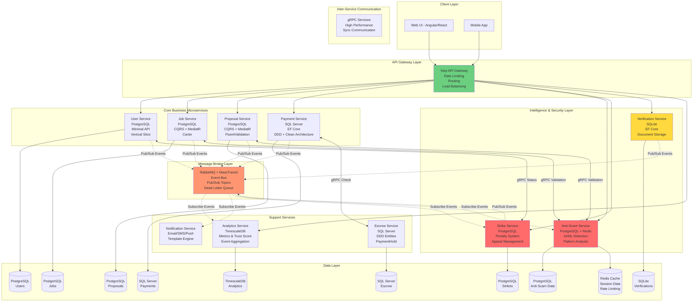

```mermaid
flowchart TB
 subgraph subGraph0["Client Layer"]
        WEB["Web UI - Angular/React"]
        MOBILE["Mobile App"]
  end
 subgraph subGraph1["API Gateway Layer"]
        YARP["Yarp API Gateway<br>Rate Limiting<br>Routing<br>Load Balancing"]
  end
 subgraph subGraph2["Core Business Microservices"]
        USER["User Service<br>PostgreSQL<br>Minimal API<br>Vertical Slice"]
        JOB["Job Service<br>PostgreSQL<br>CQRS + MediatR<br>Carter"]
        PROPOSAL["Proposal Service<br>PostgreSQL<br>CQRS + MediatR<br>FluentValidation"]
        PAYMENT["Payment Service<br>SQL Server<br>EF Core<br>DDD + Clean Architecture"]
  end
 subgraph subGraph3["Intelligence & Security Layer"]
        ANTISCAM["Anti-Scam Service<br>PostgreSQL + Redis<br>AI/ML Detection<br>Pattern Analysis"]
        STRIKE["Strike Service<br>PostgreSQL<br>Penalty System<br>Appeal Management"]
        VERIFY["Verification Service<br>SQLite<br>EF Core<br>Document Storage"]
  end
 subgraph subGraph4["Support Services"]
        ANALYTICS["Analytics Service<br>TimescaleDB<br>Metrics &amp; Trust Score<br>Event Aggregation"]
        ESCROW["Escrow Service<br>SQL Server<br>DDD Entities<br>PaymentHold"]
        NOTIFY["Notification Service<br>Email/SMS/Push<br>Template Engine"]
  end
 subgraph subGraph5["Data Layer"]
        PG1[("PostgreSQL<br>Users")]
        PG2[("PostgreSQL<br>Jobs")]
        PG3[("PostgreSQL<br>Proposals")]
        PG4[("PostgreSQL<br>Anti-Scam Data")]
        PG5[("PostgreSQL<br>Strikes")]
        SQL1[("SQL Server<br>Payments")]
        SQL2[("SQL Server<br>Escrow")]
        SQLITE[("SQLite<br>Verifications")]
        REDIS[("Redis Cache<br>Session Data<br>Rate Limiting")]
        TS[("TimescaleDB<br>Analytics")]
  end
 subgraph subGraph6["Message Broker Layer"]
        RABBITMQ["RabbitMQ + MassTransit<br>Event Bus<br>Pub/Sub Topics<br>Dead Letter Queue"]
  end
 subgraph subGraph7["Inter-Service Communication"]
        GRPC["gRPC Services<br>High Performance<br>Sync Communication"]
  end
    WEB --> YARP
    MOBILE --> YARP
    YARP --> USER & JOB & PROPOSAL & PAYMENT & ANTISCAM & STRIKE & VERIFY & ANALYTICS
    USER --> PG1
    JOB --> PG2
    PROPOSAL --> PG3
    ANTISCAM --> PG4 & REDIS
    STRIKE --> PG5
    PAYMENT --> SQL1
    ESCROW --> SQL2
    VERIFY --> SQLITE
    ANALYTICS --> TS
    USER -. Pub/Sub Events .-> RABBITMQ
    JOB -. Pub/Sub Events .-> RABBITMQ
    PROPOSAL -. Pub/Sub Events .-> RABBITMQ
    PAYMENT -. Pub/Sub Events .-> RABBITMQ
    STRIKE -. Pub/Sub Events .-> RABBITMQ
    VERIFY -. Pub/Sub Events .-> RABBITMQ
    RABBITMQ -. Subscribe Events .-> ANALYTICS & NOTIFY & STRIKE & ANTISCAM
    PROPOSAL <-- gRPC Validation --> ANTISCAM
    JOB <-- gRPC Validation --> ANTISCAM
    PAYMENT <-- gRPC Check --> ESCROW
    USER <-- gRPC Status --> STRIKE

    style YARP fill:#6bcf7f
    style ANTISCAM fill:#ff6b6b
    style STRIKE fill:#ff6b6b
    style VERIFY fill:#ffd93d
    style RABBITMQ fill:#ff9671
```
