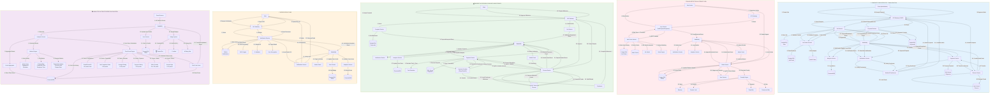

```mermaid
graph TB
subgraph FLOW1["🔄 COMPLETE JOB LIFECYCLE - End-to-End Flow"]
direction TB

        F1_CLIENT["Client (Web/Mobile)"]
        F1_GATEWAY["API Gateway (YARP)"]

        F1_CLIENT -->|"1. Create Job"| F1_GATEWAY
        F1_GATEWAY -->|"2. Route Request"| F1_JOB["Job Service"]
        F1_JOB -->|"3. Store Job"| F1_JOBDB[("PostgreSQL<br/>Jobs")]
        F1_JOB -->|"4. Validate Content"| F1_ANTISCAM["Anti-Scam Service"]
        F1_ANTISCAM -->|"5. Check Patterns"| F1_SCAMDB[("PostgreSQL<br/>Anti-Scam")]
        F1_ANTISCAM -->|"6. ML Analysis"| F1_REDIS[("Redis Cache")]
        F1_ANTISCAM -->|"7. Risk Score"| F1_JOB

        F1_JOB -->|"8. If Approved"| F1_RABBIT["RabbitMQ"]
        F1_RABBIT -->|"9. JobCreated Event"| F1_ANALYTICS["Analytics Service"]
        F1_RABBIT -->|"10. JobCreated Event"| F1_NOTIFY["Notification Service"]
        F1_ANALYTICS -->|"11. Log Metrics"| F1_TSDB[("TimescaleDB")]
        F1_NOTIFY -->|"12. Notify Freelancers"| F1_FREELANCER["Matched Freelancers"]

        F1_FREELANCER -->|"13. Submit Proposal"| F1_GATEWAY
        F1_GATEWAY -->|"14. Route"| F1_PROPOSAL["Proposal Service"]
        F1_PROPOSAL -->|"15. Validate Proposal"| F1_ANTISCAM
        F1_PROPOSAL -->|"16. Store Proposal"| F1_PROPDB[("PostgreSQL<br/>Proposals")]
        F1_PROPOSAL -->|"17. ProposalSubmitted Event"| F1_RABBIT

        F1_CLIENT -->|"18. Accept Proposal"| F1_GATEWAY
        F1_GATEWAY -->|"19. Route"| F1_PROPOSAL
        F1_PROPOSAL -->|"20. Generate Contract"| F1_PROPDB
        F1_PROPOSAL -->|"21. ProposalAccepted Event"| F1_RABBIT
        F1_RABBIT -->|"22. Initialize Payment"| F1_PAYMENT["Payment Service"]
        F1_PAYMENT -->|"23. Process Payment"| F1_PAYDB[("SQL Server<br/>Payments")]
        F1_PAYMENT -->|"24. Transfer to Escrow"| F1_ESCROW["Escrow Service"]
        F1_ESCROW -->|"25. Lock Funds"| F1_ESCDB[("SQL Server<br/>Escrow")]

        F1_ESCROW -->|"26. FundsLocked Event"| F1_RABBIT
        F1_RABBIT -->|"27. Start Work Notification"| F1_NOTIFY
        F1_NOTIFY -->|"28. Notify Freelancer"| F1_FREELANCER

        F1_FREELANCER -->|"29. Complete Work"| F1_GATEWAY
        F1_GATEWAY -->|"30. Submit Deliverable"| F1_JOB
        F1_JOB -->|"31. WorkCompleted Event"| F1_RABBIT
        F1_RABBIT -->|"32. Approval Request"| F1_NOTIFY

        F1_CLIENT -->|"33. Approve Work"| F1_GATEWAY
        F1_GATEWAY -->|"34. Release Request"| F1_ESCROW
        F1_ESCROW -->|"35. Release Funds"| F1_ESCDB
        F1_ESCROW -->|"36. Transfer"| F1_PAYMENT
        F1_PAYMENT -->|"37. Pay Freelancer"| F1_FREELANCER

        F1_PAYMENT -->|"38. PaymentCompleted Event"| F1_RABBIT
        F1_RABBIT -->|"39. Update Trust Score"| F1_ANALYTICS
        F1_RABBIT -->|"40. Close Job"| F1_JOB
    end

    subgraph FLOW2["🚨 FRAUD DETECTION & STRIKE FLOW"]
        direction TB

        F2_USER["User Action"]
        F2_GATEWAY2["API Gateway"]
        F2_SERVICE["Any Service<br/>(Job/Proposal/Payment)"]

        F2_USER -->|"1. Suspicious Action"| F2_GATEWAY2
        F2_GATEWAY2 -->|"2. Route"| F2_SERVICE
        F2_SERVICE -->|"3. gRPC Validate"| F2_ANTISCAM2["Anti-Scam Service"]

        F2_ANTISCAM2 -->|"4. Fetch User History"| F2_SCAMDB2[("PostgreSQL<br/>Anti-Scam")]
        F2_ANTISCAM2 -->|"5. Check Cache"| F2_REDIS2[("Redis Cache")]
        F2_ANTISCAM2 -->|"6. ML Model Inference"| F2_ML["ML Model"]
        F2_ANTISCAM2 -->|"7. Pattern Matching"| F2_RULES["Rules Engine"]

        F2_ANTISCAM2 -->|"8. Risk Score > Threshold"| F2_SERVICE
        F2_SERVICE -->|"9. Block Action"| F2_USER
        F2_SERVICE -->|"10. FraudDetected Event"| F2_RABBIT2["RabbitMQ"]

        F2_RABBIT2 -->|"11. Auto Strike"| F2_STRIKE["Strike Service"]
        F2_STRIKE -->|"12. Issue Strike"| F2_STRIKEDB[("PostgreSQL<br/>Strikes")]
        F2_STRIKE -->|"13. gRPC Check Status"| F2_USERSERV["User Service"]
        F2_STRIKE -->|"14. Calculate Penalty"| F2_PENALTY["Penalty Engine"]

        F2_PENALTY -->|"15. Warn"| F2_OUTCOME1["Warning"]
        F2_PENALTY -->|"16. Restrict"| F2_OUTCOME2["Feature Lock"]
        F2_PENALTY -->|"17. Suspend"| F2_OUTCOME3["Temp Ban"]
        F2_PENALTY -->|"18. Ban"| F2_OUTCOME4["Permanent Ban"]

        F2_STRIKE -->|"19. StrikeIssued Event"| F2_RABBIT2
        F2_RABBIT2 -->|"20. Notify User"| F2_NOTIFY2["Notification Service"]
        F2_RABBIT2 -->|"21. Log Incident"| F2_ANALYTICS2["Analytics Service"]

        F2_USER -->|"22. Submit Appeal"| F2_STRIKE
        F2_STRIKE -->|"23. Store Appeal"| F2_STRIKEDB
        F2_STRIKE -->|"24. AppealSubmitted Event"| F2_RABBIT2
        F2_RABBIT2 -->|"25. Admin Review"| F2_ADMIN["Admin Panel"]

        F2_ADMIN -->|"26. Approve/Reject"| F2_STRIKE
        F2_STRIKE -->|"27. Update Status"| F2_STRIKEDB
        F2_STRIKE -->|"28. If Approved: Restore"| F2_USERSERV
    end

    subgraph FLOW3["💰 PAYMENT & ESCROW FLOW WITH MILESTONES"]
        direction TB

        F3_CLIENT["Client"]
        F3_GATEWAY3["API Gateway"]

        F3_CLIENT -->|"1. Accept Proposal"| F3_GATEWAY3
        F3_GATEWAY3 -->|"2. Route"| F3_PROPOSAL2["Proposal Service"]
        F3_PROPOSAL2 -->|"3. Get Milestones"| F3_PROPDB2[("PostgreSQL<br/>Proposals")]
        F3_PROPOSAL2 -->|"4. ProposalAccepted Event"| F3_RABBIT3["RabbitMQ"]

        F3_RABBIT3 -->|"5. Initialize Payment"| F3_PAYMENT2["Payment Service"]
        F3_PAYMENT2 -->|"6. Calculate Total + Fees"| F3_FEE["Fee Calculator"]
        F3_PAYMENT2 -->|"7. Process Payment"| F3_PROVIDER["Payment Provider<br/>(Stripe/PayPal)"]
        F3_PROVIDER -->|"8. Charge Success"| F3_PAYMENT2
        F3_PAYMENT2 -->|"9. Store Transaction"| F3_PAYDB2[("SQL Server<br/>Payments")]

        F3_PAYMENT2 -->|"10. gRPC Initialize Escrow"| F3_ESCROW2["Escrow Service"]
        F3_ESCROW2 -->|"11. Create Escrow"| F3_ESCDB2[("SQL Server<br/>Escrow")]
        F3_ESCROW2 -->|"12. Lock Funds per Milestone"| F3_ESCDB2
        F3_ESCROW2 -->|"13. FundsLocked Event"| F3_RABBIT3

        F3_RABBIT3 -->|"14. Notify Parties"| F3_NOTIFY3["Notification Service"]

        F3_FREELANCER2["Freelancer"] -->|"15. Complete Milestone 1"| F3_GATEWAY3
        F3_GATEWAY3 -->|"16. Submit Work"| F3_JOB2["Job Service"]
        F3_JOB2 -->|"17. MilestoneCompleted Event"| F3_RABBIT3
        F3_RABBIT3 -->|"18. Approval Request"| F3_NOTIFY3

        F3_CLIENT -->|"19. Approve Milestone"| F3_GATEWAY3
        F3_GATEWAY3 -->|"20. Approve"| F3_ESCROW2
        F3_ESCROW2 -->|"21. Release Milestone Funds"| F3_ESCDB2
        F3_ESCROW2 -->|"22. gRPC Transfer"| F3_PAYMENT2
        F3_PAYMENT2 -->|"23. Payout to Freelancer"| F3_PROVIDER
        F3_PROVIDER -->|"24. Transfer"| F3_FREELANCER2

        F3_PAYMENT2 -->|"25. MilestonePayment Event"| F3_RABBIT3
        F3_RABBIT3 -->|"26. Update Analytics"| F3_ANALYTICS3["Analytics Service"]
        F3_ANALYTICS3 -->|"27. Update Trust Score"| F3_TSDB2[("TimescaleDB")]

        F3_CLIENT -->|"28. Dispute Milestone"| F3_GATEWAY3
        F3_GATEWAY3 -->|"29. Create Dispute"| F3_ESCROW2
        F3_ESCROW2 -->|"30. Freeze All Funds"| F3_ESCDB2
        F3_ESCROW2 -->|"31. DisputeCreated Event"| F3_RABBIT3
        F3_RABBIT3 -->|"32. Admin Arbitration"| F3_ADMIN2["Admin Panel"]

        F3_ADMIN2 -->|"33. Resolution"| F3_ESCROW2
        F3_ESCROW2 -->|"34. Split/Refund"| F3_ESCDB2
        F3_ESCROW2 -->|"35. Process Resolution"| F3_PAYMENT2
    end

    subgraph FLOW4["✅ VERIFICATION FLOW"]
        direction TB

        F4_USER2["User"]
        F4_GATEWAY4["API Gateway"]

        F4_USER2 -->|"1. Request Verification"| F4_GATEWAY4
        F4_GATEWAY4 -->|"2. Route"| F4_VERIFY["Verification Service"]
        F4_VERIFY -->|"3. Send Email OTP"| F4_NOTIFY4["Notification Service"]
        F4_NOTIFY4 -->|"4. Deliver"| F4_USER2
        F4_USER2 -->|"5. Enter OTP"| F4_GATEWAY4
        F4_GATEWAY4 -->|"6. Validate"| F4_VERIFY
        F4_VERIFY -->|"7. Mark Email Verified"| F4_VERDB[("SQLite<br/>Verifications")]

        F4_USER2 -->|"8. Upload Gov ID"| F4_GATEWAY4
        F4_GATEWAY4 -->|"9. Store Document"| F4_VERIFY
        F4_VERIFY -->|"10. OCR Processing"| F4_OCR["OCR Engine"]
        F4_VERIFY -->|"11. Validate ID"| F4_VALIDATOR["ID Validator"]
        F4_VERIFY -->|"12. Facial Match"| F4_FACE["Face Recognition"]
        F4_VERIFY -->|"13. Store Result"| F4_VERDB

        F4_VERIFY -->|"14. If Suspicious"| F4_RABBIT4["RabbitMQ"]
        F4_RABBIT4 -->|"15. Flag for Review"| F4_ADMIN3["Admin Panel"]

        F4_VERIFY -->|"16. VerificationComplete Event"| F4_RABBIT4
        F4_RABBIT4 -->|"17. Update User Profile"| F4_USERSERV2["User Service"]
        F4_USERSERV2 -->|"18. Add Badge"| F4_USERDB[("PostgreSQL<br/>Users")]
        F4_RABBIT4 -->|"19. Update Trust Score"| F4_ANALYTICS4["Analytics Service"]
        F4_ANALYTICS4 -->|"20. Boost Score"| F4_TSDB3[("TimescaleDB")]

        F4_RABBIT4 -->|"21. Notify User"| F4_NOTIFY4
        F4_NOTIFY4 -->|"22. Success Email"| F4_USER2
    end

    subgraph FLOW5["📊 ANALYTICS & TRUST SCORE CALCULATION"]
        direction TB

        F5_EVENTS["Event Sources"]
        F5_RABBIT5["RabbitMQ"]

        F5_EVENTS -->|"1. All Platform Events"| F5_RABBIT5
        F5_RABBIT5 -->|"2. Subscribe"| F5_ANALYTICS5["Analytics Service"]

        F5_ANALYTICS5 -->|"3. Aggregate Events"| F5_AGGREGATOR["Event Aggregator"]
        F5_AGGREGATOR -->|"4. Store Time-Series"| F5_TSDB4[("TimescaleDB")]

        F5_ANALYTICS5 -->|"5. Calculate Metrics"| F5_METRICS["Metrics Engine"]
        F5_METRICS -->|"6. User Activity"| F5_M1["Active Users<br/>Engagement<br/>Retention"]
        F5_METRICS -->|"7. Job Metrics"| F5_M2["Posting Rate<br/>Completion Rate<br/>Response Time"]
        F5_METRICS -->|"8. Payment Metrics"| F5_M3["Transaction Volume<br/>Success Rate<br/>Dispute Rate"]

        F5_ANALYTICS5 -->|"9. Trust Score Calculation"| F5_TRUST["Trust Score Engine"]
        F5_TRUST -->|"10. Get User History"| F5_TSDB4
        F5_TRUST -->|"11. Factor: Verifications"| F5_T1["Email/Phone/ID<br/>+10 points each"]
        F5_TRUST -->|"12. Factor: Completion"| F5_T2["Job Completion Rate<br/>0-30 points"]
        F5_TRUST -->|"13. Factor: Reviews"| F5_T3["Average Rating<br/>0-25 points"]
        F5_TRUST -->|"14. Factor: Payment"| F5_T4["Payment History<br/>0-20 points"]
        F5_TRUST -->|"15. Factor: Strikes"| F5_T5["Strike Penalty<br/>-5 to -50 points"]
        F5_TRUST -->|"16. Factor: Tenure"| F5_T6["Account Age<br/>0-15 points"]

        F5_TRUST -->|"17. Calculate Total (0-100)"| F5_SCORE["Final Trust Score"]
        F5_SCORE -->|"18. Store Score"| F5_TSDB4
        F5_SCORE -->|"19. TrustScoreUpdated Event"| F5_RABBIT5

        F5_RABBIT5 -->|"20. Update User Profile"| F5_USERSERV3["User Service"]
        F5_USERSERV3 -->|"21. Store in Profile"| F5_USERDB2[("PostgreSQL<br/>Users")]

        F5_RABBIT5 -->|"22. Award Badges"| F5_BADGE["Badge System"]
        F5_BADGE -->|"23. Trusted (80+)"| F5_B1["🏆 Trusted Pro"]
        F5_BADGE -->|"24. Verified (50+)"| F5_B2["✓ Verified"]
        F5_BADGE -->|"25. Rising (30+)"| F5_B3["⭐ Rising Star"]
    end

    style FLOW1 fill:#e3f2fd
    style FLOW2 fill:#ffebee
    style FLOW3 fill:#e8f5e9
    style FLOW4 fill:#fff3e0
    style FLOW5 fill:#f3e5f5
```
